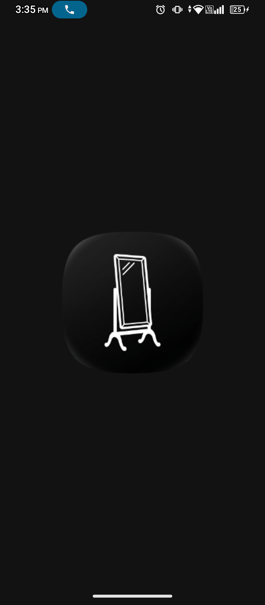
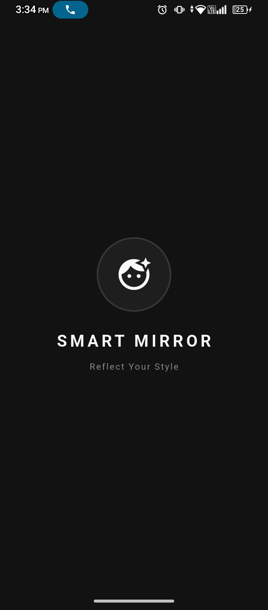
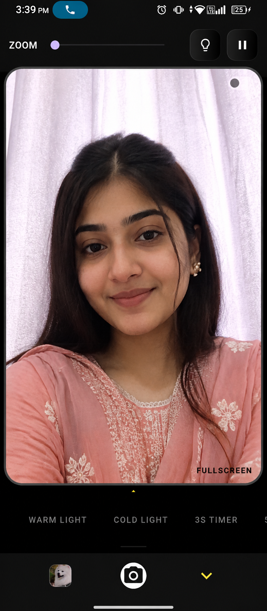

# 🪞 Smart Mirror App (Reflect Your Style)

A premium, fast, and feature-rich real-time smart mirror application built with Flutter. It utilizes hardware-accelerated HD camera rendering, intelligent gestures, built-in system states caching, and custom photo studio filters to deliver an elegant native iOS/OnePlus-like camera experience.

---

## ✨ Features Breakdown

### 📹 Pro Camera Engine & Live Feed
* **HD View Native Rendering:** Uses Flutter's `CameraPreview` combined with `FittedBox` and `OverflowBox` to maximize original camera sensor quality without skewing aspect ratios.
* **Freeze Frame (Pause/Resume):** Toggle live preview freezing seamlessly using hardware preview management (`resumePreview`/`pausePreview`).
* **Interactive Smart Zoom:** Supports unified linear slider adjustments and professional 2-finger multi-touch gestures using a custom `TransformationController` scaled systematically from 1.0x to 5.0x.

### 🎛️ Studio Exposure & Lighting Ecosystem
* **Ambient Lighting Aura Borders:** Custom custom-clipped active lighting framework (`AuraMirrorBorder`) that modifies physical UI brightness levels mimicking hardware studio ring-lights.
* **Dynamic Exposure Tone Mapping:** Instantly alters active camera matrix hardware exposure offsets:
    * **Warm Light:** Yellow-Orange Hue Multipliers (alpha: 0.12) with +0.3 exposure correction.
    * **Cold Light:** Pale Blue Balanced Overlays (alpha: 0.08) with +0.2 exposure correction.
    * **Low Light:** High Exposure Gain compensation scaling up to +1.2.

### 📸 Capture Utilities & Media Management
* **Sequential Hardware Timers:** Built-in asynchronous loop countdown intervals supporting custom 3-second and 5-second automatic snapshot actions.
* **Gal Engine Native Persistence:** Saved imagery is natively committed straight into the host system's hardware image directory instantly using platform channels.
* **State Caching System:** Uses custom `SharedPreferences` background disk writing layers to recall user media collections dynamically across hot reboots.
* **In-App Media Gallery Hub:** Responsive sliding image preview drawer featuring long-press multi-selection arrays, multi-image unified system native sharing arrays via `SharePlus` framework, and instant system array purging capabilities.

---

## 📸 Complete App Walkthrough & UI Pipelines

### 🚀 1. Cold Start & Structural Initialization Lifecycle
The application handles the boot layer transition smoothly, moving from a native hardware splash directly into an isolated custom application entryway.

| Phase 1: Native OS Boot Layer | Phase 2: Core App Hydration View |
|---|---|
|  |  |

---

### 🎚️ 2. Dynamic Studio Interface & Settings Dashboard
The mirror hub features specialized micro-sliders and lighting layouts, allowing seamless adjustments whether the live camera rendering grid is active or temporarily set aside.

| Camera Active (Studio Adjustments Panel) | UI Management (Controls View Overlay) |
|---|---|
|  |  |

---

## 📂 Project Architecture & Directory Mapping

The codebase enforces a clean separation of concerns under a scalable domain/feature directory setup:

```text
lib/
├── logics/
│   └── mirror_logic.dart           # Decoupled Core State & Hardware Camera Initializer
├── screens/
│   ├── mirror_screen.dart          # Master Coordinator & Main Workspace Pipeline
│   └── splash_screen.dart          # Native Hydration Layer & Logo Fade Entryway
├── service/
│   └── mirror_gallery_service.dart # File System Persister, In-App Gallery Layout & Action Hooks
├── widgets/
│   ├── mirror_frame_widgets.dart   # Camera Preview Composites & Absolute Position Controls
│   ├── mirror_settings_panel.dart  # Horizontal Filter Selection Bar & Micro-sliders
│   └── mirror_widgets.dart         # Custom Painters, Grids, and Glass Layer Materials
└── main.dart                       # App Native Initialization & Global Entrypoint